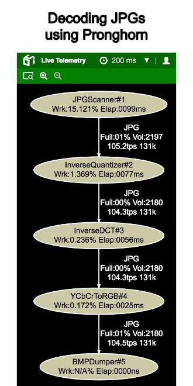
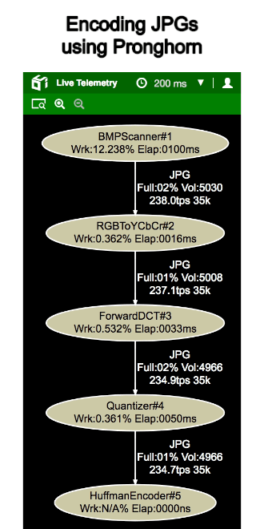

Pronghorn  [](https://pronghorn.ci.cloudbees.com/)
=====

Pragmatic approach to a staged event driven single machine embedded micro-framework.

* **Garbage free message passing** design eliminates garbage collector stalls providing predictable data rates.  
* **Lock free non-blocking message passing** enables cores to make continuous progress at all times.  
* **Staged pipeline scheduler** enables optimization of the workload across cores. 
* Small memory footprint
* Smart thread scheduling

## Documentation
Please refer to the [website](https://oci-pronghorn.gitbook.io/pronghorn/chapter-0-what-is-pronghorn/home) for documentation, how to get started, and examples.

For a catalog of all availables stages and schemas, please click [here](https://objectcomputing.github.io/Pronghorn/catalog/home/).

## Demo
Below is a recorded live demo of an application written using Pronghorn that quickly encodes and decodes JPG to raster (such as BMP) and vice versa.

**Every Pronghorn project** receives an automatically generated, live telemetry page such as the one featured below.




## Why Pronghorn?
**1. Broad compatibility** 
* Java profile compact1  
* No use of Unsafe, Java 9 module compatibility       

**2. Simple concurrency model**
* Quickly write correct code with actors  
* Easily leverage hundreds or more cores  
* All pipes are defined as produced from one actor and consumed by one other   
    
**3. Separation of design concerns**  
* Business aware scheduling
	 
   * Actors who do not have work are not scheduled  
   * Schedulers can be custom designed or existing solutions applied   
* Strong types generated externally  
   * Types between actors are externally defined  
   * New fields can be added and mapped to new business specific usages  

**4. Multiple APIs**
* Embedded friendly use of wrapping arrays  
* Integrate with a wide variety of existing interfaces  
* Visitors for reading and writing  
* Object proxies for reading and writing  
* Zero copy direct access to input and output fields  
* Replay of messages until they are released

**5. Simple debug and refactoring** 
* Messages have full provenance and actor chain upon exception   
* Test framework supports automated regression test construction for refactor   
* Fuzz testing based on message pipes definitions   
* Generative contract testing based on behavior definitions for stages  
 
**6. Static memory allocations**
* No need to release memory and no GC  
* Simplify memory usage analysis of the application   
* Minimize runtime failures, including out of memory  

**7. Copy preferred over lock usage**
* No stalled cores, block free, wait free, continuous progress  
* Efficient power usage  
* Leverages new fast memory subsystems  
* Enables efficient NUMA usage  

**8. Sequential memory usage**  
* Leverages CPU pre-fetch and caches for fastest possible throughput  
* Persistence and immediate start up for free with non-volatile memory  
* All media is sequential, mechanical sympathy  
* Maximum use of hardware bandwidth 

**9. Software sketches**
* Extensive requirements gathering put into a graph  
* Involve non-technical people in the early stages  
* Refine the design before making any commitments, or beginning iterations   

**10. Minimized deployed application**
* For embedded systems, only the needed applications and interfaces are deployed   
* Configuration is done at compile time   
* Ultra-small attack surface   
* Scales well in docker and cloud deployments   
* Targets absolute minimum resources consumed   
	
## Usage

  To use this in your Maven project, add the following dependency:

```xml
<dependency>
	<groupId>com.ociweb</groupId>
	<artifactId>Pronghorn</artifactId>
	<version>1.0.0</version>
</dependency> 
```
------------------------------------------

For more technical details please check out the Specification.md file.
Looking for the release jar? This project is under active development.

Please consider getting involved and sponsoring the completion of [Pronghorn](mailto:info@objectcomputing.com;?subject=Pronghorn%20Sponsor%20Inquiry)


Nathan Tippy, Principal Software Engineer [OCI](http://objectcomputing.com)  
Twitter: @NathanTippy
